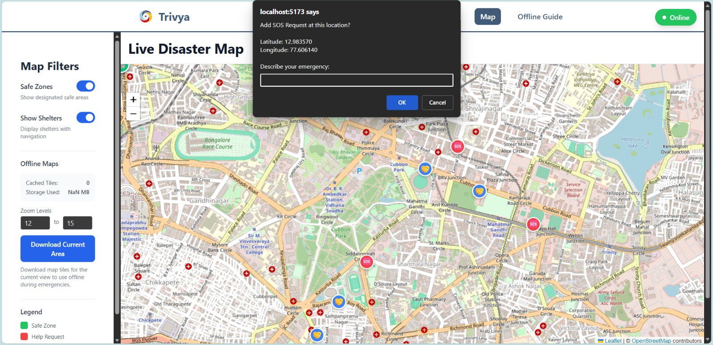

# 🛡️ Trivya — Offline-First Disaster Management PWA  
*A life-saving platform that works even when the internet fails.*

Trivya is an **offline-capable disaster response system** that connects people who need help with volunteers nearby.  
The platform continues to function during floods, cyclones, network outages, or server delays — ensuring **no one is left helpless during an emergency**.

<p align="center" style="margin-top:-20px; margin-bottom:-15px;">
  
</p>

---

## 👥 Contributors

This project was built with dedication, teamwork, and strong collaboration 🚀  

<table align="center">
  <tr>

   <td align="center" style="padding: 10px;">
      <a href="https://github.com/chayahg" style="text-decoration:none; color:inherit;">
        
        <br/><b>Chaya</b>
      </a>
    </td>

   <td align="center" style="padding: 10px;">
      <a href="https://github.com/NothingADSR123" style="text-decoration:none; color:inherit;">
        
        <br/><b>Aditya Srivastava</b>
      </a>
    </td>

   <td align="center" style="padding: 10px;">
      <a href="https://github.com/ShreyaSriranga" style="text-decoration:none; color:inherit;">
        
        <br/><b>Shreya Sriranga</b>
      </a>
    </td>

   <td align="center" style="padding: 10px;">
      <a href="https://github.com/divyesh0505" style="text-decoration:none; color:inherit;">
        
        <br/><b>Divyesh Kishor Gadilohar</b>
      </a>
    </td>

  </tr>
</table>

⚡ Each member played a key role — from building offline maps, volunteer flow, SOS routing, UI/UX, and backend sync logic.

---

# 🚨 Problem Statement  
During natural disasters like **floods, heavy rains, cyclones, and earthquakes**, the first thing that fails is:

- Internet  
- Maps  
- Alerts  
- Messaging  
- Coordination  
- Navigation  

People cannot request help, volunteers cannot respond, and lifesaving time is lost.

---

# ✔ Solution  
Trivya solves this through an **Offline-First Architecture**, ensuring:

- Help requests are stored offline  
- Syncs automatically when net returns  
- Offline maps for shelters & safe zones  
- SOS alerts delivered instantly  
- Real-time volunteer navigation  
- Trusted, tamper-proof request logs  

Trivya transforms disaster response from **reactive → prepared**.

---

# ✨ Key Innovations

### 🔷 Offline Maps (Leaflet + Tile Cache)  
Users can **download map tiles** for their area and use them even when network is down.

### 🔷 Auto-Sync Using IndexedDB  
Requests are saved offline and auto-sent when connection restores.

### 🔷 WebRTC Peer Sync (Fallback Mode)  
When servers are unreachable, devices around can sync requests peer-to-peer.

### 🔷 Shelter Navigation  
Realtime routing from:  
**Victim → Volunteer → Nearest Shelter**

### 🔷 Minimal, Emergency-Optimized UI  
Designed so people in panic can operate easily.

---

# 📌 Real-Life Use Cases

### ✔ Flood rescue  
A person trapped in a flooded street sends a help request offline → synced once connection returns → nearest volunteer receives alert.

### ✔ Volunteer Navigation  
Volunteers get step-by-step routing to the victim and then to the nearest shelter.

### ✔ Network outage  
During cyclone, internet drops → offline tiles allow people to still view shelters and safe zones.

---

# 🖼️ Screenshots

### 🏠 Homepage  
<p align="center">
  
</p>

---

### 🗺️ Live Disaster Map  
<p align="center">
  
</p>

---

### 🤝 Volunteer Dashboard  
<p align="center">
  
</p>

---

### 🚨 Emergency Help Request  
<p align="center">
  
</p>

---

### 🌀 Logo  
<p align="center">
  
</p>

---

# 🏗️ Tech Stack

### **Frontend**
- React.js  
- Leaflet Maps  
- Tailwind CSS  
- Vite  

### **Offline & Sync**
- IndexedDB  
- Service Worker  
- WebRTC DataChannel  
- Local Tile Caching  

### **Backend**
- Node.js  
- Express.js  
- REST APIs  
- WebSocket Alerts  

---

# 🔌 API Endpoints

| Method | Endpoint | Description |
|--------|----------|-------------|
| POST | `/api/requests` | Create new help request |
| GET | `/api/requests` | Fetch active requests |
| POST | `/api/sync` | Sync offline queue |
| GET | `/api/shelters` | List safe zones & shelters |

---

# 📁 Project Structure

```
DisasterManagement/
├── backend/
│   ├── routes/
│   ├── services/
│   ├── socket.js
│   ├── server.js
│   └── package.json
│
├── frontend/
│   ├── public/
│   ├── src/
│   │   ├── components/
│   │   ├── pages/
│   │   ├── lib/
│   │   ├── App.jsx
│   │   └── main.jsx
│   └── package.json
│
└── README.md
```

---

# 🛠️ Setup Instructions

## 🔧 Prerequisites
- Node.js (v18+)  
- npm or yarn  
- No paid APIs, fully open-source  
- Works locally & offline  

---

## 🚀 Frontend Setup

1️⃣ Clone the repository  
```bash
git clone <your-repo-link>
```

2️⃣ Navigate to the frontend directory  
```bash
cd DisasterManagementDSATM/frontend
```

3️⃣ Install dependencies  
```bash
npm install
```

4️⃣ Start the development server  
```bash
npm run dev
```

The app will run at:  
👉 http://localhost:5173

---

## 🖥️ Backend Setup

1️⃣ Navigate to the backend directory  
```bash
cd DisasterManagementDSATM/backend
```

2️⃣ Install dependencies  
```bash
npm install
```

3️⃣ Create `.env`  
```
PORT=5001
```

4️⃣ Start backend  
```bash
npm start
```

API base URL:  
👉 http://localhost:5001

---

# 🧪 Sample API Test

Example: Create a map-based emergency request

```bash
curl -X POST http://localhost:5001/api/requests \
  -H "Content-Type: application/json" \
  -d '{ 
        "lat": 12.9730,
        "lng": 77.6061,
        "description": "Stuck near main road, need assistance",
        "urgency": "high"
      }'
```

---

# 🫴🏻 Contributing

1. Fork the repository  
2. Create a new branch  
3. Commit your changes  
4. Push the branch  
5. Open a Pull Request  

---

# 🫶🏻 Acknowledgements

- OpenStreetMap  
- Leaflet.js  
- Node.js  
- Vite  
- IndexedDB  
- Service Workers  
- WebRTC  
- DSATM Hackathon Team  


